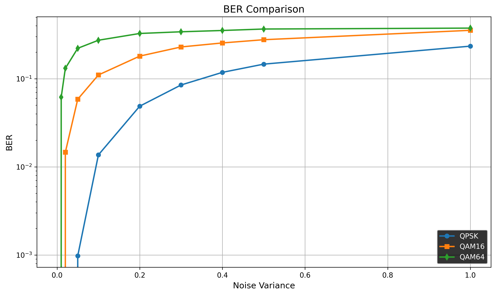

# QPSK/QAM16/QAM64 Modulator/Demodulator

Проект реализует модуляцию и демодуляцию сигналов для схем QPSK, QAM16 и QAM64.

### Требования
- CMake ≥ 3.20
- Компилятор C++20 (GCC, Clang или MSVC)
- Git (для клонирования репозитория)

### Сборка
```bash
git clone https://github.com/shmblg4/YADRO_test_task.git
cd YADRO_test_task/Task_1
mkdir build && cd build
cmake .. -DCMAKE_BUILD_TYPE=Release
make -j$(nproc)
```

### BER vs Noise
